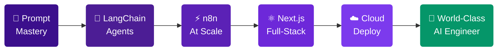

<div align="center">


<br/>

[](https://git.io/typing-svg)

<br/>


&nbsp;

&nbsp;

&nbsp;


</div>

---


### 👋 &nbsp; Hey, I'm Abdullah

AI Automation Engineer from 🇧🇩 Bangladesh building intelligent systems that work 24/7.

I design **end-to-end automation pipelines**, **LLM-powered applications**, and **full-stack web experiences** — connecting the dots between AI models, APIs, and real business outcomes.

```
🔭  Currently  →  Building AI agent workflows with n8n + Claude
🌱  Learning   →  LangChain · LangFlow · Next.js App Router
💡  Specialty  →  Prompt Engineering · API Orchestration · WordPress
⚡  Vibe       →  Flow-state dev with Cursor, Copilot & Claude
📬  Contact    →  abdullahalzahed45@gmail.com
```

<br clear="right"/>

---

<div align="center">

## 🤖 &nbsp; AI · Automation · LLMs


</div>

---

<div align="center">

## 🎨 &nbsp; Frontend


<br/><br/>

## ⚙️ &nbsp; Backend · Database · Cloud


<br/><br/>

## 🌐 &nbsp; WordPress Ecosystem


&nbsp;&nbsp;

&nbsp;

&nbsp;


<br/><br/>

## 🎵 &nbsp; Vibe Coding


&nbsp;

&nbsp;

&nbsp;

&nbsp;

&nbsp;


</div>

---

<div align="center">

## 🚀 &nbsp; What I Build

</div>

<table>
<tr>
<td align="center" width="33%">

<br/><b>AI Automation Systems</b>
<br/><sub>End-to-end workflows with n8n, Make & Zapier connected to GPT-4 & Claude — from lead gen bots to full business process automation.</sub>
</td>
<td align="center" width="33%">

<br/><b>LLM-Powered Apps</b>
<br/><sub>RAG pipelines, AI agents & LangChain integrations. Raw AI models → production-grade tools that solve real business problems.</sub>
</td>
<td align="center" width="33%">

<br/><b>Full-Stack Web Apps</b>
<br/><sub>React, Next.js & Tailwind CSS. Pixel-perfect, performance-optimized, and built to scale from day one.</sub>
</td>
</tr>
<tr>
<td align="center" width="33%">

<br/><b>WordPress Solutions</b>
<br/><sub>Custom themes, plugins, Elementor builds & WooCommerce stores. Scalable, secure & maintainable.</sub>
</td>
<td align="center" width="33%">

<br/><b>API Integrations</b>
<br/><sub>Connect any SaaS stack — CRMs, ERPs, payment systems & communication tools. If it has an API, I'll connect it.</sub>
</td>
<td align="center" width="33%">

<br/><b>Business Automation</b>
<br/><sub>Eliminate repetitive tasks: email flows, data sync, smart reporting & real-time CRM automation.</sub>
</td>
</tr>
</table>

---

<div align="center">

## 📊 &nbsp; GitHub Analytics

<br/>


&nbsp;&nbsp;


<br/><br/>


</div>

---

<div align="center">

## 🏆 &nbsp; Achievements


</div>

---

<div align="center">

## 🗺️ &nbsp; 2026 Roadmap



**`[ ]`** 100+ production AI systems &nbsp;·&nbsp; **`[ ]`** Master React & Next.js &nbsp;·&nbsp; **`[ ]`** Ship 3 LangChain SaaS tools  
**`[ ]`** Help 50+ clients automate &nbsp;·&nbsp; **`[ ]`** 5 open-source templates &nbsp;·&nbsp; **`[ ]`** 5 vibe-coded products

</div>

---

<div align="center">

## 🤝 &nbsp; Let's Build Something Great

<br/>

[](https://linkedin.com/in/YOUR_LINKEDIN)
&nbsp;
[](mailto:abdullahalzahed45@gmail.com)
&nbsp;
[](https://your-portfolio.com)

<br/>

[](https://upwork.com/freelancers/YOUR_PROFILE)
&nbsp;
[](https://fiverr.com/YOUR_PROFILE)
&nbsp;
[](https://github.com/abdullahaljahed50-hub)

<br/><br/>


<br/><br/>

</div>


<div align="center">
  <sub>⚡ <b>Abdullah Al Jahed</b> · 🇧🇩 Bangladesh · Building the future with AI, one workflow at a time</sub>
</div>
