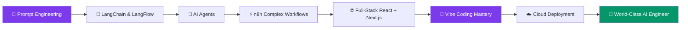

<div align="center">


<br/>

[](https://git.io/typing-svg)

<br/>


&nbsp;

&nbsp;

&nbsp;


</div>

---


### 👋 &nbsp; Hey, I'm Abdullah Al Jahed

AI Automation Engineer from 🇧🇩 Bangladesh building intelligent systems that work 24/7.

I design **end-to-end automation pipelines**, **LLM-powered applications**, and **full-stack web experiences** — connecting the dots between AI models, APIs, and real business outcomes.

```
🔭  Currently  →  Building AI agent workflows with n8n + Claude
🌱  Learning   →  LangChain · LangFlow · Next.js App Router
💡  Specialty  →  Prompt Engineering · API Orchestration · WordPress
⚡  Vibe       →  Flow-state dev with Cursor, Copilot & Claude
📬  Contact    →  abdullahalzahed45@gmail.com
```

<br clear="right"/>

---

<div align="center">


| Technology | Proficiency | Use Case |
|---|---|---|
| **HTML5** | ████████████ Expert | Semantic markup, accessibility, SEO structure |
| **CSS3** | ████████████ Expert | Animations, Grid, Flexbox, custom properties |
| **JavaScript (ES6+)** | ██████████░░ Advanced | DOM, async/await, APIs, modern JS patterns |
| **TypeScript** | ████████░░░░ Intermediate | Type-safe apps, interfaces, generics |
| **React.js** | ████████░░░░ Intermediate | Hooks, context, component architecture |
| **Next.js** | ██████░░░░░░ Learning | SSR, SSG, App Router |
| **Tailwind CSS** | ████████████ Expert | Utility-first rapid UI building |

</details>

<details open>
<summary><b>⚙️ Backend & Databases</b></summary>
<br/>

<p align="center">
  
</p>

| Technology | Proficiency | Use Case |
|---|---|---|
| **Python** | ████████░░░░ Intermediate | AI scripting, automation, data processing |
| **Node.js** | ██████░░░░░░ Learning | REST APIs, server-side logic |
| **MongoDB** | ██████░░░░░░ Learning | NoSQL, document-based data models |
| **Firebase** | ████████░░░░ Intermediate | Auth, Firestore, hosting, real-time DB |
| **MySQL** | ██████░░░░░░ Basic | Relational databases, queries |

</details>

<details open>
<summary><b>🤖 AI, Automation & Workflow Tools</b></summary>
<br/>

<p align="center">
  
  &nbsp;
  
  
  
  
  
  
  
</p>

| Tool | Proficiency | Use Case |
|---|---|---|
| **n8n** | ████████████ Expert | Complex multi-step workflow automation |
| **Make** | ████████░░░░ Advanced | Visual automation, scenario building |
| **Zapier** | ████████░░░░ Advanced | SaaS app integrations, trigger-action flows |
| **LangChain** | ██████░░░░░░ Learning | LLM chains, agents, RAG pipelines |
| **LangFlow** | ██████░░░░░░ Learning | Visual LLM flow builder |
| **AI Agents** | ████████░░░░ Expert | Autonomous task agents, multi-agent systems |
| **Prompt Engineering** | ████████████ Expert | Optimizing LLM outputs, chain-of-thought |
| **API Integration** | ████████████ Expert | REST APIs, webhooks, OAuth flows |

</details>

<details open>
<summary><b>🌐 WordPress Ecosystem</b></summary>
<br/>

<p align="center">
  
  &nbsp;
  
  
  
</p>

| Skill | Proficiency | Details |
|---|---|---|
| **WordPress Theme Development** | ████████████ Expert | Custom themes from scratch, child themes, theme.json |
| **WordPress Plugin Development** | ████████░░░░ Advanced | Custom plugins, hooks, filters, shortcodes |
| **Elementor Pro** | ████████████ Expert | Dynamic content, custom widgets, global styles |
| **WooCommerce** | ████████░░░░ Advanced | E-commerce customization, payment gateways |
| **ACF (Advanced Custom Fields)** | ████████████ Expert | Custom field groups, flexible content |
| **PHP** | ████████░░░░Expert | WordPress backend, custom functions |

</details>

<details open>
<summary><b>🎵 Vibe Coding</b></summary>
<br/>

<p align="center">
  
  
  
  
  
  
</p>

| Tool / Skill | Proficiency | Use Case |
|---|---|---|
| **Cursor IDE** | ████████████ Expert | AI-native coding, codebase chat, inline edits |
| **GitHub Copilot** | ████████████ Expert | Autocomplete, test gen, PR summaries |
| **Claude (Anthropic)** | ████████████ Expert | Architecture planning, complex refactors, code review |
| **v0 by Vercel** | ████████░░░░ Advanced | Prompt-to-UI component generation |
| **Bolt.new** | ████████░░░░ Advanced | Full-stack app scaffolding from natural language |
| **Windsurf** | ██████░░░░░░ Learning | Agentic coding flows, multi-file edits |
| **Prompt-to-Code** | ████████████ Expert | Translating ideas into working code via AI prompts |
| **Flow-State Dev** | ████████████ Expert | Rapid iteration, intuition-driven architecture |

</details>

<details open>
<summary><b>🔧 Tools & DevOps</b></summary>
<br/>

<p align="center">
  
</p>

</details>

---

<div align="center">

## 🚀 &nbsp; WHAT I BUILD

</div>

<table align="center">
<tr>
<td width="33%" align="center">

### 🤖 AI Automation Systems
Build end-to-end intelligent workflows using n8n, Make, Zapier connected to GPT/Claude APIs — from lead gen bots to full business process automation

</td>
<td width="33%" align="center">

### 🌐 Web Applications
Full-stack responsive websites and web apps using React, Next.js, Tailwind CSS — pixel-perfect and performance-optimized

</td>
<td width="33%" align="center">

### 🔌 WordPress Solutions
Custom theme & plugin development, Elementor builds, WooCommerce stores — scalable, secure, and maintainable

</td>
</tr>
<tr>
<td width="33%" align="center">

### 🧠 LLM-Powered Apps
RAG pipelines, AI agents, LangChain/LangFlow integrations — turning raw AI models into production-grade tools

</td>
<td width="33%" align="center">

### ⚡ API Integrations
Connect any SaaS tool together — CRMs, ERPs, communication platforms, payment systems, databases

</td>
<td width="33%" align="center">

### 📊 Business Automation
Eliminate repetitive tasks through smart workflows — email automation, data sync, reporting, notifications

</td>
</tr>
<tr>
<td width="33%" align="center">

### 🎵 Vibe Coding
Building apps with intuition-driven, flow-state development — using AI pair-programming tools like Cursor, Copilot & Claude to ship fast, stay in the zone, and turn vibes into working products

</td>
<td width="33%" align="center">
</td>
<td width="33%" align="center">
</td>
</tr>
</table>

---

<div align="center">

## 📊 &nbsp; GITHUB ANALYTICS

<br/>


<br/>


<br/><br/>


</div>

---

<div align="center">

## 🏆 &nbsp; GITHUB TROPHIES


</div>

---

<div align="center">

## 🎯 &nbsp; CURRENT FOCUS & ROADMAP

</div>



**2026 Goals:**
- [ ] 🤖 Build 100+ production AI automation systems
- [ ] ⚛️ Master React & Next.js ecosystem
- [ ] 🧠 Ship 3 LangChain-powered SaaS tools
- [ ] 🌍 Help 50+ clients automate their business workflows
- [ ] 📦 Publish 5 open-source automation templates
- [ ] 🎵 Ship 5+ projects built purely in vibe coding flow-state

---

<div align="center">

## 🤝 &nbsp; LET'S CONNECT & BUILD TOGETHER

<br/>

[](https://linkedin.com/in/YOUR_LINKEDIN)
[](mailto:abdullahalzahed45@gmail.com)
[](https://github.com/abdullahaljahed50-hub)
[](https://your-portfolio.com)
[](https://upwork.com/freelancers/YOUR_PROFILE)
[](https://fiverr.com/YOUR_PROFILE)

<br/>

</div>

---

<div align="center">


<br/><br/>

<!-- Footer Wave -->


make the all proficiency level advanced or expert


<sub>⚡ Built with passion by Abdullah Al Jahed · Bangladesh 🇧🇩 · Automating the future, one workflow at a time</sub>

</div>
</div>
