<div align="center">


</div>

<div align="center">

<a href="https://git.io/typing-svg">
  
</a>

<br/><br/>


&nbsp;&nbsp;

&nbsp;&nbsp;


</div>

---

<div align="center">

## `< ABOUT ME />`

</div>

<table>
<tr>
<td width="55%">

```typescript
const abdullah = {
  name     : "Abdullah Al Jahed",
  location : "🇧🇩 Dhaka, Bangladesh",
  roles    : [
    "AI Automation Engineer",
    "Full-Stack Developer",
    "WordPress Expert",
    "Vibe Coding Specialist"
  ],
  currentlyBuilding : "AI agents that automate entire business workflows",
  dailyStack        : ["n8n", "Claude", "React", "WordPress"],
  goal              : "World-Class AI Automation Engineer",
  available         : true,  // Open for freelance & collab
  philosophy        : "Engineer intelligence. Automate chaos. Compound value."
};
```

</td>
<td width="45%" align="center">

### 🎯 2026 Mission
<br/>

```
█████████████████  Build 100+ AI systems
████████████░░░░░  Master React & Next.js
████████░░░░░░░░░  Ship 3 LangChain SaaS tools
██████░░░░░░░░░░░  Help 50+ businesses automate
████░░░░░░░░░░░░░  5 open-source templates
██░░░░░░░░░░░░░░░  5 vibe-coded products
```

</td>
</tr>
</table>

> *"I don't just write code — I engineer intelligence, automate chaos, and build systems that compound value over time."*

---

<div align="center">

## `< TECH ARSENAL />`

</div>

<details open>
<summary><b>🤖 &nbsp; AI · Automation · LLMs &nbsp; — Core Expertise</b></summary>
<br/>

<div align="center">

| Tool / Framework | Level | What I Do With It |
|:---|:---:|:---|
| **n8n** | `★★★★★ Expert` | Complex multi-step workflows, custom nodes, webhook orchestration |
| **Make** | `★★★★★ Expert` | Scenario automation, visual pipelines, SaaS data routing |
| **Zapier** | `★★★★★ Expert` | Trigger-action integrations, multi-step zaps, app connectors |
| **AI Agents** | `★★★★★ Expert` | Autonomous task agents, tool-use loops, multi-agent systems |
| **Prompt Engineering** | `★★★★★ Expert` | Chain-of-thought, few-shot, system prompts, structured outputs |
| **LangChain** | `★★★★★ Expert` | LLM chains, RAG pipelines, agent toolkits |
| **LangFlow** | `★★★★★ Expert` | Visual LLM orchestration, flow deployment |
| **OpenAI / Anthropic APIs** | `★★★★★ Expert` | GPT-4, Claude integration, function calling, streaming |
| **API Integration** | `★★★★★ Expert` | REST, webhooks, OAuth 2.0, rate limiting, error handling |

</div>

<br/>

<div align="center">


</div>

</details>

<br/>

<details open>
<summary><b>🎨 &nbsp; Frontend Development</b></summary>
<br/>

<div align="center">

</div>

<br/>

<div align="center">

| Technology | Level | Specialty |
|:---|:---:|:---|
| **HTML5** | `★★★★★ Expert` | Semantic markup, accessibility (WCAG), SEO architecture |
| **CSS3** | `★★★★★ Expert` | Animations, Grid, Flexbox, custom properties, scroll effects |
| **JavaScript (ES6+)** | `★★★★☆ Advanced` | DOM mastery, async patterns, modules, Web APIs |
| **TypeScript** | `★★★☆☆ Intermediate` | Typed components, interfaces, generics, strict mode |
| **React.js** | `★★★☆☆ Intermediate` | Hooks, context, component patterns, state management |
| **Next.js** | `★★☆☆☆ Growing` | SSR, SSG, App Router, ISR |
| **Tailwind CSS** | `★★★★★ Expert` | Utility-first rapid UI, custom config, dark mode |

</div>

</details>

<br/>

<details open>
<summary><b>⚙️ &nbsp; Backend · Databases · Cloud</b></summary>
<br/>

<div align="center">

</div>

<br/>

<div align="center">

| Technology | Level | Use Case |
|:---|:---:|:---|
| **Python** | `★★★☆☆ Intermediate` | AI scripting, automation pipelines, data processing |
| **Node.js** | `★★★☆☆ Growing` | REST APIs, server-side logic, Express |
| **Firebase** | `★★★☆☆ Intermediate` | Auth, Firestore, Realtime DB, hosting |
| **MongoDB** | `★★☆☆☆ Growing` | NoSQL, document models, aggregation |
| **MySQL** | `★★☆☆☆ Basic` | Relational queries, joins, schema design |
| **Supabase** | `★★☆☆☆ Growing` | Postgres, edge functions, row-level security |

</div>

</details>

<br/>

<details open>
<summary><b>🌐 &nbsp; WordPress Ecosystem</b></summary>
<br/>

<div align="center">

&nbsp;&nbsp;


</div>

<br/>

<div align="center">

| Skill | Level | Details |
|:---|:---:|:---|
| **WordPress Theme Development** | `★★★★★ Expert` | Custom themes from scratch, child themes, FSE, theme.json |
| **Plugin Development** | `★★★★☆ Advanced` | Custom plugins, hooks, filters, shortcodes, REST endpoints |
| **Elementor Pro** | `★★★★★ Expert` | Dynamic templates, custom widgets, global styles, loops |
| **WooCommerce** | `★★★★☆ Advanced` | Custom stores, payment gateways, checkout flows |
| **ACF Pro** | `★★★★★ Expert` | Custom field groups, flexible content, options pages |
| **PHP** | `★★★★☆ Advanced` | WP backend, OOP patterns, custom REST API |

</div>

</details>

<br/>

<details open>
<summary><b>🎵 &nbsp; Vibe Coding Toolkit</b></summary>
<br/>

<div align="center">


</div>

<br/>

> 🎵 *Vibe Coding is the art of building in flow-state — using AI pair-programmers to translate intuition into working products at the speed of thought.*

<div align="center">

| Tool | Level | Superpower |
|:---|:---:|:---|
| **Cursor IDE** | `★★★★★ Expert` | Codebase chat, inline AI edits, multi-file refactors |
| **GitHub Copilot** | `★★★★★ Expert` | Autocomplete, test generation, PR summaries |
| **Claude (Anthropic)** | `★★★★★ Expert` | Architecture planning, complex logic, code review |
| **v0 by Vercel** | `★★★★☆ Advanced` | Prompt-to-UI component generation |
| **Bolt.new** | `★★★★☆ Advanced` | Full-stack scaffolding from natural language |
| **Lovable** | `★★★☆☆ Growing` | Product-level app generation from descriptions |
| **Windsurf** | `★★★☆☆ Growing` | Agentic multi-file coding flows |

</div>

</details>

---

<div align="center">

## `< WHAT I BUILD />`

</div>

<table>
<tr>
<td width="50%">

```
╔══════════════════════════════════╗
║   🤖 AI AUTOMATION SYSTEMS       ║
╠══════════════════════════════════╣
║  End-to-end intelligent work-    ║
║  flows using n8n, Make, Zapier   ║
║  connected to GPT-4 & Claude.    ║
║  Lead gen bots → full business   ║
║  process automation pipelines.   ║
╚══════════════════════════════════╝
```

</td>
<td width="50%">

```
╔══════════════════════════════════╗
║   🧠 LLM-POWERED APPLICATIONS    ║
╠══════════════════════════════════╣
║  RAG pipelines, autonomous AI    ║
║  agents, LangChain/LangFlow      ║
║  integrations. Raw AI models →   ║
║  production-grade tools that     ║
║  actually solve real problems.   ║
╚══════════════════════════════════╝
```

</td>
</tr>
<tr>
<td width="50%">

```
╔══════════════════════════════════╗
║   🌐 WEB APPLICATIONS            ║
╠══════════════════════════════════╣
║  Full-stack responsive sites &   ║
║  web apps. React, Next.js,       ║
║  Tailwind CSS. Pixel-perfect,    ║
║  performance-optimized, and      ║
║  built to scale.                 ║
╚══════════════════════════════════╝
```

</td>
<td width="50%">

```
╔══════════════════════════════════╗
║   🔌 API INTEGRATIONS            ║
╠══════════════════════════════════╣
║  Connect any SaaS stack to-      ║
║  gether — CRMs, ERPs, payment    ║
║  systems, communication tools,   ║
║  and databases. If it has an     ║
║  API, I can connect it.          ║
╚══════════════════════════════════╝
```

</td>
</tr>
<tr>
<td width="50%">

```
╔══════════════════════════════════╗
║   🔌 WORDPRESS SOLUTIONS         ║
╠══════════════════════════════════╣
║  Custom theme & plugin dev,      ║
║  Elementor builds, WooCommerce   ║
║  stores. Scalable, secure, and   ║
║  maintainable codebases that     ║
║  clients can actually manage.    ║
╚══════════════════════════════════╝
```

</td>
<td width="50%">

```
╔══════════════════════════════════╗
║   📊 BUSINESS AUTOMATION         ║
╠══════════════════════════════════╣
║  Eliminate repetitive tasks:     ║
║  email automation, data sync,    ║
║  smart reporting, real-time      ║
║  notifications, and end-to-end   ║
║  CRM workflow automation.        ║
╚══════════════════════════════════╝
```

</td>
</tr>
</table>

---

<div align="center">

## `< GROWTH ROADMAP />`

```mermaid
flowchart LR
    A(["🧠 Prompt\nEngineering"]) --> B(["🔗 LangChain\n& LangFlow"])
    B --> C(["🤖 Advanced\nAI Agents"])
    C --> D(["⚡ Complex n8n\nWorkflows"])
    D --> E(["⚛️ React &\nNext.js Mastery"])
    E --> F(["🎵 Vibe Coding\nAt Scale"])
    F --> G(["☁️ Cloud &\nDevOps"])
    G --> H(["🚀 World-Class\nAI Engineer"])

    style A fill:#4c1d95,color:#fff,stroke:#7c3aed
    style B fill:#5b21b6,color:#fff,stroke:#7c3aed
    style C fill:#6d28d9,color:#fff,stroke:#7c3aed
    style D fill:#7c3aed,color:#fff,stroke:#a78bfa
    style E fill:#7c3aed,color:#fff,stroke:#a78bfa
    style F fill:#8b5cf6,color:#fff,stroke:#c4b5fd
    style G fill:#a78bfa,color:#fff,stroke:#c4b5fd
    style H fill:#059669,color:#fff,stroke:#34d399,stroke-width:3px
```



</div>

---

<div align="center">

## `< GITHUB ANALYTICS />`

<br/>


&nbsp;


<br/><br/>


<br/><br/>


</div>

---

<div align="center">

## `< ACHIEVEMENTS />`


</div>

---

<div align="center">

## `< CONNECT & BUILD TOGETHER />`

<br/>

[](https://linkedin.com/in/YOUR_LINKEDIN)
&nbsp;
[](mailto:abdullahalzahed45@gmail.com)
&nbsp;
[](https://github.com/abdullahaljahed50-hub)

<br/>

[](https://your-portfolio.com)
&nbsp;
[](https://upwork.com/freelancers/YOUR_PROFILE)
&nbsp;
[](https://fiverr.com/YOUR_PROFILE)

<br/><br/>


<br/><br/>

---

### 💡 Got an idea that needs automation, AI, or a full build?

**Let's make it real.**

📬 **abdullahalzahed45@gmail.com** &nbsp;|&nbsp; 🇧🇩 **Bangladesh (UTC+6)** &nbsp;|&nbsp; ⚡ **Usually responds in < 24hrs**

<br/>

</div>


<div align="center">
<sub>
⚡ Engineered with precision by <b>Abdullah Al Jahed</b> &nbsp;·&nbsp; 🇧🇩 Bangladesh &nbsp;·&nbsp; Automating the future, one workflow at a time
</sub>
</div>
